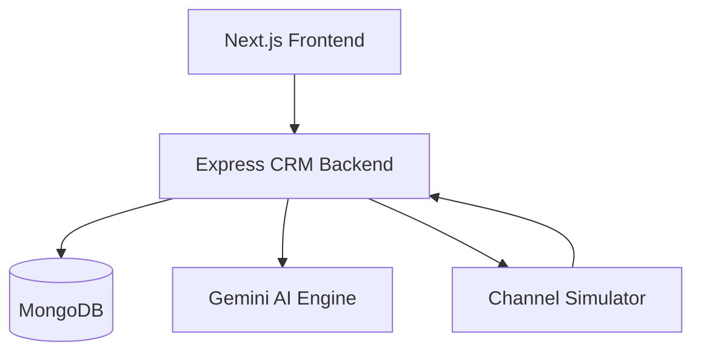

# 🚀 Nexo CRM

### AI-Powered Customer Engagement & Campaign Automation Platform

> An AI-native Mini CRM built for the Xeno Engineering Take-Home Assignment 2026 that helps brands intelligently segment customers, generate personalized campaigns, simulate multi-channel communication, and track engagement performance.

---

## 📌 Table of Contents

* Overview
* Problem Statement
* Solution
* Key Features
* AI-Native Capabilities
* Architecture
* Tech Stack
* Project Structure
* Campaign Workflow
* Setup & Installation
* Environment Variables
* Running the Application
* Testing
* Scalability & Design Decisions
* Future Improvements
* Author

---

# 🎯 Problem Statement

Consumer brands often struggle to:

* Identify the right audience
* Personalize communication at scale
* Track campaign effectiveness
* Analyze customer engagement

Nexo CRM solves this by combining customer data, AI-powered segmentation, campaign automation, and analytics into a single platform.

---

# 💡 Solution Overview

Nexo CRM enables marketers to:

1. Import customer and order data
2. Create intelligent audience segments
3. Generate personalized campaign content using AI
4. Send campaigns through simulated channels
5. Track delivery and engagement events
6. Measure campaign performance in real time

---

# ✨ Key Features

## 📊 Executive Dashboard

* Revenue metrics
* Customer statistics
* Campaign performance analytics
* Engagement funnels

## 🎯 Audience Segmentation

* Rule-based filtering
* Spend-based targeting
* Geographic targeting
* Purchase behavior analysis

## 📬 Campaign Management

* Create campaigns
* Select audiences
* Choose communication channels
* Schedule and launch campaigns

## 📈 Analytics & Insights

* Delivered messages
* Failed messages
* Open rates
* Read rates
* Click-through rates
* Conversion tracking

---

# 🤖 AI-Native Capabilities

## AI Segment Builder

Convert natural language into targeting rules.

Example:

"Customers from Delhi who spent more than ₹5000 in the last 90 days"

↓

MongoDB-compatible segment filters.

---

## AI Copywriter

Generate campaign messages automatically.

Examples:

* Promotional messages
* Festival offers
* Re-engagement campaigns
* Customer retention campaigns

---

## AI Co-Pilot

Interactive assistant that helps marketers:

* Build audiences
* Create campaigns
* Optimize messaging
* Analyze performance

---

# 🏗 Architecture



---

# 🔄 Campaign Lifecycle

```text
Customer Data
      ↓
Audience Segment
      ↓
AI Message Generation
      ↓
Campaign Launch
      ↓
Channel Simulator
      ↓
Delivery Events
      ↓
Analytics Dashboard
```

---

# 🛠 Tech Stack

| Layer      | Technology                   |
| ---------- | ---------------------------- |
| Frontend   | Next.js, React, TypeScript   |
| Styling    | Tailwind CSS                 |
| Backend    | Node.js, Express.js          |
| Database   | MongoDB                      |
| AI         | Google Gemini                |
| Charts     | Recharts                     |
| Testing    | TypeScript Integration Tests |
| Deployment | Render              |

---

# 📂 Project Structure

```bash
nexo-crm/
│
├── frontend/
│   ├── app/
│   ├── components/
│   └── services/
│
├── backend/
│   ├── controllers/
│   ├── models/
│   ├── routes/
│   ├── services/
│   └── testIntegration.ts
│
├── channel-service/
│   ├── controllers/
│   └── server.ts
│
└── README.md
```

---

# ⚙️ Environment Variables

## Backend

```env
PORT=5000
MONGODB_URI=your_mongodb_uri
GEMINI_API_KEY=your_gemini_api_key
```

## Frontend

```env
NEXT_PUBLIC_API_URL=http://localhost:5000
```

---

# 🚀 Local Setup

## Backend

```bash
cd backend
npm install
npm run dev
```

## Channel Service

```bash
cd channel-service
npm install
npm run dev
```

## Frontend

```bash
cd frontend
npm install
npm run dev
```

Frontend:
http://localhost:3000

Backend:
http://localhost:5000

Channel Service:
http://localhost:6000

---

# 🧪 Integration Testing

Run:

```bash
cd backend

npx ts-node src/testIntegration.ts
```

This test automatically:

* Seeds sample customers
* Creates segments
* Launches campaigns
* Simulates channel callbacks
* Tracks conversions
* Validates campaign metrics

---

# 📈 Scalability Considerations

Current implementation:

* MongoDB for persistence
* Express API architecture
* Asynchronous callback processing

Production improvements:

* Kafka/RabbitMQ queues
* Redis caching
* Horizontal scaling
* Event-driven architecture
* Distributed workers

---

# 🚀 Future Enhancements

* Campaign scheduling
* Predictive customer scoring
* AI-based channel optimization
* Customer lifetime value prediction
* Multi-tenant support
* A/B testing engine
* Real-time notification center

---

# 👨‍💻 Author

Ritik Kumar

B.Tech CSE | Full Stack Developer

Built for the Xeno Engineering Internship Assignment 2026.

---

# 📄 License

This project was developed as part of the Xeno Engineering Take-Home Assignment and is intended for educational and evaluation purposes.
